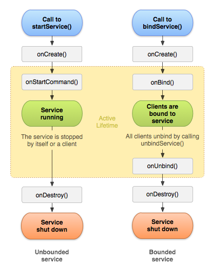

### doit_kotlin_sample

1. 안드로이드의 기본적인 내용 복습 
2. 코틀린 사용해보기

#### Begin

* .gitignore 

~~~
\.idea/
\.gradle/
\build/
\app/build/
\local.properties
~~~

* 모듈 단위로 분할하여 진행

#### Resource

* 가로/세로 전환에 대한 대응 (layout 폴더 참고)

#### Dialog and Notification

[SourceCode](ch10_notification/src/main/java/com/huni/engineer/ch10_notification/DialogTestActivity.kt)

* api 30 이후 Toast 기능
* datepicker
* dialog
* alarm and vibrate
* notification 채널
  - 알람의 터치 이벤트 : PendingIntent 사용
  - 액션 : 알람취소, 전화 앱의 수신 / 거절 등
  - 원력 입력 : remoteInput 사용
  - 프로그래스 : builder.setProgress 이용
  - 알림 스타일 : 큰 이미지 / 긴 텍스트 / 상자 / 메시지 

#### Jetpack

   * ActionBar
        * 화면 위쪽에 타이틀 문자열이 출력되는 영역  
   
   * Toolbar
        * Actionbar 와 동작은 비슷하나, 개발자가 직접 제어하는 View
   
   * Fragment

#### Material Design

#### Activity Component
3. 엑티비티 제어

   * 3-1. 입력 매니저
     
     * InputMethodManager (SoftKeyboard 관련)
   
   * 3-2. 입력 모드 - Manifest 의 windowSoftInputMode 사용

     * adjustPan: 키보드가 올라올 때 입력 에디트 테그슽에 맞춰서 화면을 위로 올림
     * adjustResize: 키보드가 올라올 때 엑티비티의 크기 조정
     * adjustUnspecified: 상황에 맞는 옵션을 시스템이 알아서 조정 (기본값)
     * stateHidden: 액티비티 실행 시 키보드가 자동으로 올라오는 것을 방지
     * stateVisible:
     * stateUnspecified

   * 3-3. 방향과 전체 화면 설정
     
     * 방향 - screenOrientation 사용
     * 전체화면 - NoActionBar 사용
     * API 30 이상의 경우 : WindowInsetsController를 사용해야함

   * 3-4. 태스크 관리

     * 액티비티를 어떻게 생성하고 관리하는지를 제어하는 일
       1. Standard - 엑티비티에서 인텐트가 발생하면 항상 객체가 생성되고 테스크에 등록
       2. SingleTop - 액티비티 정보가 테스크의 위쪽에 있을 때 인텐트가 발생해도 객체를 생성하지 않음 (onNewIntent)
                              테스크 위쪽에 있을때만 객체를 생성하지 않는다. (ex. 채팅에서 노티로 타 채팅방에 이동하는 경우)
       3. SingleTask - 새로운 테스크를 만들어 등록 (다른 앱일 경우에만 적용)
       4. ingleInstance - 새로운 테스크를 만들어 등록하지만, 그 테스트에는 해당 설정이 적용된 엑티비티 하나만 등록 = 액티비티 하나가 혼자 테스크를 차지한다.

   * 3-5. ANR and Coroutine

     * ANR (Activity Not Response) : 액티비티가 응답하지 않는 오류
     * 액티비티를 실행한 메인 스레드 이외에 실행 흐름을 따로 만들어서 시간이 오래 걸리는 작업을 담당하게 해야한다.
     * 그러나 이 방법으로는 화면 변경이 안됨. 화면 변경은 메인스레드만 할 수 있음
     * 코루틴의 사용

       * Coroutine (비동기 경량 스레드)
         
       * 특징
         * 경량 
         * 메모리 누수가 적음
         * 취소 등 다양한 기능 제공
         * 많은 제트팩 라이브러리에 적용
   
       * Scope
         1. Dispatchers.Main : 액티비티의 메인 스레드에서 코루틴 생성
         2. Dispatchers.IO : 파일에 읽거나 쓰기 또는 네트워크 작업에 최적화
         3. Dispatchers.Default : CPU를 많이 사용하는 작업을 백그라운드에서 실행
         
       * Channel
         * 코루틴의 값을 전달받을 수 있는 방법을 제공 (Queue 알고리즘과 비슷)

#### Broadcast Receiver

* 이벤트 모델로 실행되는 컴포넌트 (사용자 이벤트가 아닌 시스템의 특정한 상황) 
  * ex) 부팅이 완료됨 
* 만들기
  1. 명시적 - 클래스명만 등록
  2. 암시적 - intent-filter에 선언필요
* 등록과 해제
  * registerReceiver()
  * unregisterReciver()

* 부팅완료 
  * BOOT_COMPLETED 사용
* 화면끔 / 킴
  * Intent.ACTION_SCREEN_OFF
  * Intent.ACTION_SCREEN_ON
* 배터리상태
  * BATTERY_LOW - 베터리 낮은 상태로 변경
  * BATTERY_OKAY - 정상상태로 변경
  * BATTERY_CHANGED - 충전상태로 변경
  * ACTION_POWER_CONNECTED - 전원이 공급되기 시작한 순간
  * ACTION_POWER_DISCONNECTED - 전원이 공급끊은 순간

#### Service

* 백그라운드 작업을 목적으로 하는 컴포넌트
* 서비스를 실행하는 Intent 함수는 2가지 (startService / bindService)

* startService
  * 해당 서비스를 인텐트에 담아서 실행 (명시적으로)
  
~~~kotlin
                //startService
                val intent = Intent(this, MyService::class.java)
                startService(intent)

                //외부 앱의 경우 암시적 인텐트 사용필요 -> 패키지 name 전달
                val intent = Intent("ACTION_OUTER_SERVICE")
                intent.setPackage("com.example.test_outer")
                startService(intent)

                //stopService를 통해 종료
                val intent = Intent(this, MyService::class.java)
                stopService(intent)
~~~

* bindService
  * ServiceConnection 인터페이스를 구현한 객체가 필요
  
~~~kotlin
                val connection: ServiceConnection = object : ServiceConnection {
                    override fun onServiceConnected(p0: ComponentName?, p1: IBinder?) {
                        //서비스 구동시 자동 호출
                    }

                    override fun onServiceDisconnected(p0: ComponentName?) {
                        //서비스 소멸시 자동 호출
                    }
                }

                val intent = Intent(this, MyService::class.java)
                //intent, connection, flag
                bindService(intent, connection, Context.BIND_AUTO_CREATE)

                //종료
                unbindService(connection)
~~~

* 서비스 생명주기
  * https://developer.android.com/guide/components/services?hl=ko
  * 

* 특징

  * startService

    * 백그라운드 작업이 필요하지만, 엑티비티와 데이터를 주고받을 일이 없는 등 서로 관련이 없는 경우

    * bindService

        * 엑티비티와 서비스가 상호작용해야하는 경우

            * IBinder
              IBinder interface 사용하여 fun 구현하여, Activity에서 connection 생겼을때 사용 가능함.

            * Messenger 바인딩 (프로세스 간 통신을 할때도 사용 가능)

                *  내부앱 연동

                    * ~~~kotlin
                      //onbind반환값으로 messenger 생성하여 binder속성을 반환한다.
                      messenger = Messenger(IncomingHandler(this))
                      return messenger.binder
                      ~~~

                * 외부앱

                  * intent-filter로 외부앱 연동하도록 선언해야한다.
                    * queries로 연동하고자하는 앱의 패키지명을 지정해야한다.
                    * 프로세스 간 통신은 parcelable 이나 bundle을 사용해야한다.

          * AIDL(Android Interface Definition Language) 통신 기법

            * 두 프로세스 사이에 데이터를 주고받는 프로세스 간 통신을 구현할때 사용하는 기법
            * bindService() 함수를 이용
            * 데이터를 시스템에 전달 -> 시스템이 다른 프로세스로 전달
            * 시스템이 사용하는 데이터는 시스템이 해석할 수 있는 원시타입으로 반환해야한다 -> 이 과정을 마샬링(marshalling) 이라고한다
              * AIDL을 이용하면 이러한 작업을 대신 처리해준다!!
            * 메신저와의 차이점
              * 구현은 메신저방식이  AIDL 보다 쉽게 구현이 가능하다
              * 그러나 플랫폼에서 제공하는 API를 이용해야하므로 주고받는 데이터의 종류가 많을 때 효율이 떨어짐
              * 또한 메신저는 외부 요청을 싱글 스레드에서 처리한다 / AIDL은 요청이 많으면 멀티 스레드 환경에서 동시 실행
            * 구현은 과제 참고..

* 백그라운드 제약

  * 에전에는 사용자가 앱을 실행해 화면이 출력된 적이 없는 상황에서도 서비스나 브로드캐스트리시버로 백그라운드 작업이 가능했다

    * 하지만 안드로이드 API 26 이상부터는 제약

  * 브로드캐스트 리시버의 백그라운드 제약

    * 매니패스트에 등록한 리시버를 암시적으로 실행할 때는 같은 앱의 리시버든 외부 앱의 리시버든 실행되지 않는다.
    * 리시버를 코드에서 registerReceiver() 함수로 등록하면 암시적 인텐트로도 실행할 수 있다.

  * 서비스의 백그라운드 제약

    * 서비스는 앱이 백그라운드 상태일 때 인텐트를 전달하면 오류가 발생
      * Foreground 상황
        1. 액티비티가 시작되든 일시 중지되든 상관없이 보이는 엑티비티가 있을 때
        2. 포그라운드 서비스가 있을 때
        3. 앱의 서비스에 바인딩하거나 앱의 콘텐츠 프로바이더를 사용해 또 다른 포그라운드 앱이 연결되었을 때
      * Background 상황
        1. 우선순위가 높은 파이어베이스 클라우드 메시징(FCM) 처리
        2. SMS/MSS 메시지와 같은 브로드캐스트 수신
        3. 알림에서 PendingIntent 실행
        4. VPN 앱이 포그라운드로 승격되기 전에 VpnService 시작
    * 앱이 백그라운드 상황에서도 서비스를 실행할 방법 -> startForegroundService() 함수로 인텐트를 시작
    * 그러나 얼마 후 강제 종료됨 -> 빨리 startForeground 함수를 호출하여 포그라운드 상태로 만들어야함 - 그래야 제약을 벗어날 수 있다.

    

* 잡 스케쥴러 

  * 앱이 백그라운드 상황일 때 작업 처리에 제약을 받으나, 잡스케쥴러로 보완이 가능
  * 잡 스케쥴러도 개발자가 만드는 서비스 -> 어떤 상황에서 실행해야 하는지 조건 명시가 필요
  * 잡 스케쥴러의 실행 조건
    * 네트워크 타입
    * 베터리 충전 상태
    * 특정 앱의 콘텐츠 프로바이더 갱신 (ex. 갤러리 앱)
  * 실행 주기, 최소 지연 시간, 시스템 재구동 시 현재 조건 유지 여부 등을 조건으로 명시할 수 있다
  * 잡 스케쥴러의 3가지 구성 요소
    * 잡 서비스: 백그라운드에서 처리할 작업을 구현한 서비스
    * 잡 인포: 잡 서비스 정보와 실행될 조건을 지정합니다.
    * 잡 스케쥴러: 잡 인포를 시스템에 등록합니다.
  * JobScheduleActivity 참고. [JobService](ch15_service/src/main/java/com/huni/ch15_service/sample/jobschedule/JobScheduleActivity.kt)

#### Content Provider

* 앱끼리 데이터를 연동하는 컴포넌트
* 외부 앱의 데이터는 기본적으로 접근이 불가능 (보안 문제)
* 콘텐츠 프로바이더가 외부 앱에 허가 / 접근 등을 가능하게함

* 특징
  * 콘텐츠 프로바이더는 인텐트와 상관없이 시스템이 필요한 순간에 자동으로 생성해준다.
  * 즉 query(), insert(), update(), delete() 함수만 호출해 주면 된다.

#### 데이터 베이스

* 대표적으로 SQLite
* 테이블의 데이터를 앱의 저장소에 파일로 저장함 -> 외부앱이 접근 불가능
* 코드에서는 질의문만 작성하면된다 (실제 데이터는 SQLite가 관리)

* 질의문

  * 데이터베이스 객체 생성

    ~~~kotlin
    val db = openOrCreateDatabase("testdb", Context.MODE_PRIVATE, null)
    ~~~

  * db 객체 생성 이후 execSQL(), rawQuery() 사용 가능함

* 데이터베이스 관리
  * SQLiteOpenHelper 클래스로 관리 (테이블 생성, 변경, 제거)
  * 추상클래스이므로 상속받아서 하위 클래스를 작성해야한다

* 파일에 보관하기

  * SQLite나 Preference는 특정 API를 이용하여 파일로 저장하는 방식

  * 앱에 직접 파일을 만들어 데이터를 쓰거나 읽는 방법은? -> java.io 패키지에서 제공하는 클래스를 사용
  
* 앱 파일 저장소

  * 내장 메모리 (앱별 저장소)
  * 외장 메모리 (앱별 저장소와 공용 저장소)

  
* 내장 메모리의 파일 이용하기

  * 내장 메모리는 앱이 설치되면 시스템이 자동으로 할당하는 공간 

  * 안드로이드 시스템은 앱에서 파일을 이용하지 않아도 앱의 패키지명으로 디렉토리 생성 = 앱의 내장 메모리 공간

  * 해당 앱만 접근 가능 = 민감한 데이터 관리, 크기 자체는 작다

  * 파일을 내장 메모리에 저장할려면 java.io 의 File Class 사용 

    ~~~kotlin
    //파일 저장 (filesDir - Context객체)
    val file = File(filesDir, "test.txt")
    val writeStream: OutputStreamWriter = file.writer()
    writeStream.write("hello world")
    writeStream.flush()
    ~~~

  * 저장된 데이터를 읽어서 가져오는 방법

    ~~~kotlin
    val readStream: BufferedReader = file.reader().buffered()
    readStream.forEachLine {
        //TODO..
    }
    ~~~

  * 또는 Context객체가 제공하는 openFileOutput(), openFileInput()을 사용하여 읽기/쓰기가 가능

* 외장 메모리 파일 이용하기

  * 외부 저장 장치 (SD카드등) 도 있으나, 내부 저장소의 파티션을 나누어 외장 메모리로도 저장 가능

  * 외장 메모리 제공 여부를 Enviroment.getExternalStorageState() 로 체크한다.

    ~~~ko
    if (Environment.getExternalStorageState() == Environment.MEDIA_MOUNTED) {
        Log.d(TAG, "MOUNTED!!")
    } else {
        Log.d(TAG, "UNMOUNTED!!")
    }
    ~~~

  * 외장 메모리의 파일 이용시에 manifest에 permission 설정 필요

    ~~~
    <uses-permission android:name="android.permission.READ_EXTERNAL_STORAGE"/>
    <uses-permission android:name="android.permission.WRITE_EXTERNAL_STORAGE"/>
    //application 영역단에 설정
    android:requestLegacyExternalStorage="true"
    ~~~

  * 외장메모리의 앱별 저장소 - getExternalFilesDir() 함수로 찾는다

    ~~~ko
    //외부저장소 - 앱별저장소 접근
    val file:File? = getExternalFilesDir(null)
    Log.d(TAG, "${file?.absolutePath}")
    
    //경로 - /storage/emulated/0/Android/data/com.huni.ch17_storage/files 
    //null 대신에 DIRECTORY_PICTURES, DOCUMENTS, MUSIC 등등 사용가능
    ~~~

  * 파일 프로바이더로 외부 공유 (외장 메모리의 앱별 저장소를 외부앱에게 공유하려고 하면)

    * 외부에 공유할 경로를 res/xml에 xml파일을 만들어 지정해줘야한다.

    * 그 후 매니패스트에  provider 태그로 등록한다.

      

* 공용 저장소 이용

  * 앱에서 만든 파일을 모든 앱이 이용할 수 있게끔 하도록.. (ex. Camera 앱)
  * 내장메모리/외장메모리의 앱별 저장소는 앱 삭제시 파일 전부 삭제되나, 공용저장소의 경우는 앱을 삭제하더라도 파일이 삭제되지 않음

* SharedPreference
  * 플랫폼 API에서 제공하는 Class
  * 데이터를 key - value 형태로 저장
  * 내장메모리 앱 폴더에 XML 파일로 저장됨

* SharedPreferences 접근 방식
  1. Activity.getPreferences(int mode)
  2. Context.getSharedPreferences(String name, int Mode)
  
* 앱 설정 화면 만들기
  * 앱 설정 화면을 만들어주는 api가 있다!! (androidx.preference:preference-ktx:1.1.1)
  * res/xml에 설정과 관련된 xml 파일을 만들어야한다

